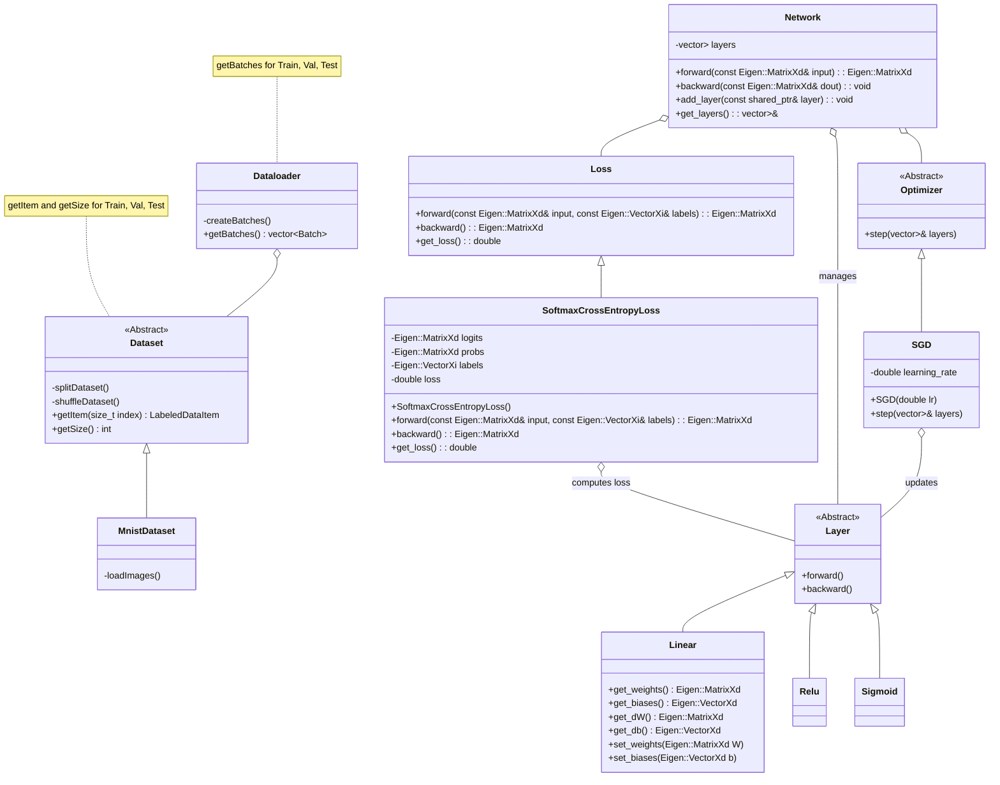

# Group_22


Deep Learning Project

## Build
### Linux
```bash
cmake -DCMAKE_CXX_COMPILER=g++ -S . -B build
cmake --build build
```
### Windows
```bash
cmake -G "MinGW Makefiles" -DCMAKE_CXX_COMPILER=g++ -S . -B build
cmake --build build
```
### Check Version
Make sure you use version 14.2.0. This should be at top of the output of `cmake -DCMAKE_CXX_COMPILER=g++ -S . -B build`:
```
-- The C compiler identification is GNU 14.2.0
-- The CXX compiler identification is GNU 14.2.0
```

## Test
To test the code run the unit tests via the `build/tests` executable.

## Class Diagramm


## Sprint 1

### Definition of Done
- The Dataloader should load .png images from the disk into memory in some usable format.
- Functions for computing the linear layer forward and backward (gradient) pass are implemented.
- Functions for computing sigmoid forward and backward (gradient) pass are implemented.

### Classes needed
- Dataset, MnistDataset
- Dataloader
- Layers

## Sprint 2 Modularising using OOP

This sprint is about structuring the code in a modular fashion to ultimately allow flexible generation of network architectures.

### Sprint 2: Definition of "done"
The following functionalities are implemented:
- A Layer parent class offering methods for forward and backward pass and the following child classes:
  - Linear layer, parameterised by the number of input featuers and the number of neurons (output features)
  - Sigmoid layer
  - Softmax & Cross Entropy Loss (*)
- A Network class: Accepts a vector of layers, an optimiser, a loss layer and supports:
  - forward: computes the output of the layers forward functions applied in sequential order
  - backward: all layers store their gradients w.r.t. the loss function
  - update: all layers weights are updated by a step of the specified optimiser
- An optimiser parent class offering a step method and the following child class:
  - Vanilla SGD, accepting a learning rate parameter and performing a simple gradient descent update

*Note: While these are a lot of components, all of them should be implementable in less than 25, most in less than 10 lines of code.*

*(\*) It is much easier to implement the CE Loss backward pass (gradient) assuming that its inputs come from the Softmax function. I recommend putting the gradient through Softmax and CE into the CE backward function and making the Softmax backward pass the identity (Those are always used in combination). The explanation for why is given here: https://www.parasdahal.com/softmax-crossentropy*
## Sprint 3 Code quality and performance

This sprint is about finalising the project by cleaning and optimising the code.

### Sprint 3: Definition of "done"

[ *performance* ]:
- Matrix operations are performed by an optimised library where possible
- Move operations are used where possible

[ *features* ]:
- A more performant optimiser such as SGD + Momentum or ADAM is implemented.
- A second loss function, e.g. MSE loss is implemented
- The Parameterised Leaky ReLu, parameterised by the slope for negative inputs, activation function is implemented

[ *code structure* ]:
- The dataloader uses iterators

[ *style points* ]:
- Achieve at least 30% accuracy on Mnist ;)
